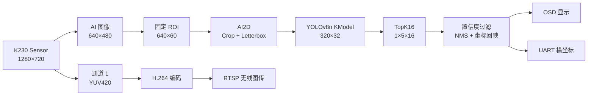

<div align="center">

# 2026 年电子设计大赛 H 题

## 车载平衡滚球运动控制系统 · K230 视觉方案

基于 **K230 / CanMV + YOLOv8n + TopK16 + RTSP** 的钢球实时检测与无线图传方案

<p>
  
  
  
  
  
</p>

[项目简介](#-项目简介) · [处理流程](#-系统处理流程) · [训练与部署](#-模型训练与部署) · [板端运行](#-k230-端处理) · [实测结果](#-实测结果)

</div>

## 📖 项目简介

本项目面向 **2026 年电子设计大赛 H 题——车载平衡滚球运动控制系统**，整理其中的视觉部分，主要包含：

- 使用自训练的 **YOLOv8n** 模型实时检测钢球位置；
- 针对固定运动区域裁剪窄 ROI，将模型输入压缩为 `320×32`；
- 在 ONNX 尾部加入 **TopK16**，减少 K230 端输出搬运和 Python 后处理量；
- 使用同一 Sensor 的 `CAM_CHN_ID_1` 编码 H.264，并通过 **RTSP** 实现无线图传；
- 将钢球中心横坐标通过 UART 发送给下位机。

在当前硬件、固件和参数配置下，关闭 **CanMV IDE 预览**后，作者实测钢球识别循环可达到 **约 80 FPS**。RTSP 推流单独配置为 `512×288 @ 15 FPS`。

### 核心配置

| 项目 | 当前配置 |
| --- | --- |
| 主控平台 | K230 / CanMV |
| 相机配置 | `Sensor(width=1280, height=720, fps=120)` |
| AI 图像尺寸 | `640×480` |
| 固定检测区域 | `[x=0, y=210, w=640, h=60]` |
| 模型输入 | `[1, 3, 32, 320]` |
| 原始模型输出 | `[1, 5, 210]` |
| TopK 模型输出 | `[1, 5, 16]` |
| RTSP | H.264，`512×288 @ 15 FPS`，端口 `9954` |
| 串口输出 | `A5 5A + 横坐标百位/十位/个位` |
| 80 FPS 测试条件 | 关闭 CanMV IDE 预览 |

## 🔄 系统处理流程



通过“**固定区域检测 + 窄输入推理 + 候选框降序筛选**”，模型不再处理与钢球运动无关的大面积背景，从而降低 K230 端的前处理、输出搬运和后处理开销。

## 📁 仓库结构

```text
2026-steelball-vision/
├─ k230/
│  ├─ README.md                      # K230 板端部署说明
│  └─ user_main/                     # 复制到 /sdcard/user_main
│     ├─ main.py                     # 板端主程序
│     ├─ yolo_benchmark.py           # AI2D、推理、TopK 后处理与绘制
│     ├─ wifi_transmit.py            # Wi-Fi 连接与 RTSP 推流
│     ├─ wifi_config.py.example      # Wi-Fi 配置模板
│     └─ user_uart.py                # UART 坐标发送
├─ training/
│  ├─ README.md                      # 训练、导出和转换说明
│  ├─ yolo_train.py                 # YOLOv8n 训练
│  ├─ yolo_convert.py               # PT 导出 ONNX
│  ├─ export_yolo_roi_topk.py       # 为 ONNX 添加 TopK16
│  ├─ to_kmodel.py                  # ONNX 转 KModel
│  ├─ requirements-training.txt     # 训练环境依赖
│  ├─ requirements-k230-convert.txt # KModel 转换环境依赖
│  ├─ yolov8n_roi_320_30_topk.kmodel # 可直接部署的 TopK16 KModel
│  └─ data_set/
│     ├─ README.md                  # 数据集说明
│     ├─ data.yaml                  # YOLO 数据配置
│     ├─ images/
│     │  ├─ train/                  # 347 张训练图像
│     │  └─ val/                    # 57 张验证图像
│     └─ labels/
│        ├─ train/                  # 347 个训练标签
│        └─ val/                    # 57 个验证标签
├─ results/
│  └─ roi_320x32/
│     ├─ README.md                  # 训练指标说明
│     ├─ results.csv                # 逐 epoch 指标
│     └─ results.png                # 训练曲线
├─ .gitattributes
├─ .gitignore
└─ README.md
```

## 🧠 模型训练与部署

### 1. 环境准备

建议使用 Anaconda 将标注、训练和模型转换环境相互隔离。以下版本来自本项目本机环境，便于复现。

| 环境 | Python | 主要软件包 |
| --- | --- | --- |
| `labelimg` | `3.9.0` | labelImg `1.8.6`、PyQt5 `5.15.11`、lxml `6.0.2`、Pillow `11.3.0` |
| `yolo` | `3.11.15` | Ultralytics `8.4.107`、PyTorch `2.13.0+cu130`、ONNX `1.22.0`、ONNX Runtime `1.28.0` |
| `k230_convert` | `3.11.15` | nncase `2.11.0`、ONNX `1.15.0`、onnxsim `0.4.36`、ONNX Runtime `1.19.0` |

#### 1.1 数据标注环境

```powershell
conda create -n labelimg python=3.9 -y
conda activate labelimg
python -m pip install labelImg==1.8.6 PyQt5==5.15.11 lxml==6.0.2 Pillow==11.3.0
labelImg
```

#### 1.2 YOLO 训练环境

先使用 `nvidia-smi` 查看显卡驱动支持的 CUDA 版本，再前往 [PyTorch Start Locally](https://docs.pytorch.org/get-started/locally/) 选择对应平台和 CUDA 构建，执行官网生成的安装命令。PyTorch 安装完成后，再安装 Ultralytics 及本项目依赖。

```powershell
conda create -n yolo python=3.11 -y
conda activate yolo
nvidia-smi

# 先执行 PyTorch 官网针对本机生成的安装命令，再执行：
python -m pip install -r .\training\requirements-training.txt
```

Ultralytics 官方通用安装命令为 `python -m pip install -U ultralytics`，详见 [Ultralytics Quickstart](https://docs.ultralytics.com/quickstart/)。本仓库的 `requirements-training.txt` 用于复现当前已观测版本。

#### 1.3 KModel 转换环境

先按照嘉楠官方教程配置 nncase 与 K230 转换工具链，再安装本项目记录的核心依赖：

```powershell
conda create -n k230_convert python=3.11 -y
conda activate k230_convert
python -m pip install -r .\training\requirements-k230-convert.txt
```

转换前需要确认 `NNCASE_PLUGIN_PATH` 已正确配置。完整环境说明参考 [嘉楠 K230 YOLO 大作战](https://www.kendryte.com/k230_canmv/zh/main/example/ai/yolo_battle.html)。

### 2. 构建 YOLO 数据集

仓库已包含本项目使用的 YOLO 格式钢球数据集，按照训练集 `train` 和验证集 `val` 划分：

```text
training/data_set/
├─ data.yaml
├─ images/
│  ├─ train/
│  └─ val/
└─ labels/
   ├─ train/
   │  ├─ *.txt
   │  └─ classes.txt
   └─ val/
      ├─ *.txt
      └─ classes.txt
```

`training/data_set/data.yaml` 已配置好数据路径与类别，可直接供训练脚本读取。使用 LabelImg 继续补充数据时选择 **YOLO** 输出格式，并开启自动保存。当前项目只有一个类别：

```text
0: ball
```

标签文件采用 YOLO 归一化格式；模型训练时的类别名称以 `data.yaml` 中的 `names` 为准。

#### 仓库内数据集统计

| 划分 | 图片 | 标签文件 | 目标框 | 图片尺寸分布 |
| --- | ---: | ---: | ---: | --- |
| 训练集 | 347 | 347 | 438 | 95 张 `320×30`；252 张 `640×60` |
| 验证集 | 57 | 57 | 87 | 29 张 `320×30`；28 张 `640×60` |

数据集共包含 404 张图像、404 个配对标签和 525 个目标框，所有标注类别均为 `0`。

原始检测 ROI 为 640×60，等比例缩放后有效图像尺寸为 320×30。由于 YOLOv8n 的最大 stride 为 32，训练时使用 rect=True，在图像上下各填充 1 行，将实际模型输入对齐为 320×32。ONNX、KModel 和 K230 板端均保持该输入尺寸。

窄图由 K230 录像分帧后，围绕钢球实际运动区域裁剪得到。这样既能减少背景干扰，也能显著降低后续推理输入量。裁剪已有标注图片时，需要同步裁剪目标框、截断越界框并重新计算 YOLO 归一化坐标。

### 3. 训练 YOLOv8n 并导出 ONNX

训练脚本使用官方 `yolov8n.pt` 预训练权重，主要参数为：

```python
epochs = 100
imgsz = 320
rect = True
mosaic = 0.0
batch = -1
cache = "ram"
```

其中 `rect=True` 使用最小矩形填充，使同一长宽比的窄图只补齐到 stride 的整数倍，而不是强制填充成 `320×320`。参数含义可参考 [Ultralytics Train 文档](https://docs.ultralytics.com/modes/train/)。

```powershell
conda activate yolo
python .\training\yolo_train.py
```

训练结束后，将最佳权重复制到导出脚本约定的位置并导出 ONNX：

```powershell
Copy-Item .\runs\detect\train\weights\best.pt .\training\yolov8n_roi_320_30.pt
python .\training\yolo_convert.py
```

导出脚本固定使用 `imgsz=(32, 320)`、`batch=1`、`opset=11`、`nms=False`。Ultralytics 的 ONNX 导出参数说明见 [Export 文档](https://docs.ultralytics.com/modes/export/)。

| 张量 | 名称 | 形状 | 含义 |
| --- | --- | --- | --- |
| 输入 | `images` | `[1, 3, 32, 320]` | NCHW RGB 图像 |
| 原始输出 | `output0` | `[1, 5, 210]` | `[cx, cy, w, h, score] × 210` |

### 4. 添加 TopK16 并转换 KModel

对于 `320×32` 输入，YOLOv8 检测头的三个尺度共产生 210 个候选框：

```text
stride 8 : 40 × 4 = 160
stride 16: 20 × 2 =  40
stride 32: 10 × 1 =  10
                       ───
合计                   210
```

本项目在原始 ONNX 图尾部追加以下算子：

```text
[1, 5, 210]
  └─ Gather：取第 4 通道的 ball 置信度
      └─ TopK：按置信度降序取前 16 个索引
          └─ Expand + GatherElements：同步取回 5 个通道
              └─ [1, 5, 16]
```

执行导出脚本：

```powershell
conda activate yolo
python .\training\export_yolo_roi_topk.py
```

脚本会：

1. 检查原始模型输入必须为 `[1, 3, 32, 320]`、输出必须为 `[1, 5, 210]`；
2. 生成按置信度降序排列的 `yolov8n_roi_320_30_topk.onnx`；
3. 使用 ONNX Runtime 对比 NumPy TopK 结果，检查输出形状与最大数值误差。

输出元素数量由 `5×210=1050` 降为 `5×16=80`，减少约 **92.4%**，可以减少模型输出搬运和 Python 候选框遍历量。

切换到转换环境，将 TopK ONNX 量化为 KModel：

```powershell
conda activate k230_convert
python .\training\to_kmodel.py `
  --target k230 `
  --model .\training\yolov8n_roi_320_30_topk.onnx `
  --dataset .\training\data_set\images\train `
  --input_width 320 `
  --input_height 32 `
  --ptq_option 0
```

仓库已提供转换完成的 `training/yolov8n_roi_320_30_topk.kmodel`，模型输入为 `[1, 3, 32, 320]`，输出为 `[1, 5, 16]`，可直接用于下方的 K230 板端部署。上述命令用于重新生成该模型。

## 🧩 K230 端处理

导出的 KModel 不包含完整的图像前处理和检测后处理，因此板端通过 `AIBase` 与 `Ai2d` 完成以下逻辑。

### 前处理

1. 从 `640×480` AI 图像中裁剪固定区域 `[0, 210, 640, 60]`；
2. 使用 AI2D 完成 Crop、双线性缩放与 Letterbox；
3. 将图像整理为 `[1, 3, 32, 320]` 后送入 KPU。

### 后处理

1. 读取已经按置信度降序排列的 `[1, 5, 16]` 输出；
2. 使用生产配置阈值 `confidence=0.60` 过滤低置信候选框；
3. 将 `cx, cy, w, h` 解码为角点坐标；
4. 消除 Letterbox 缩放与填充，将坐标映射回 `640×480` 图像；
5. 将检测框限制在 ROI 内，并使用 `NMS=0.45` 去除重叠框；
6. 当前单球任务最多保留 1 个检测结果，绘制 OSD 并发送中心横坐标。

### RTSP 无线图传

程序将同一 Sensor 的 `CAM_CHN_ID_1` 配置为 YUV420 通道，用于 H.264 编码和 RTSP 推流，无需再初始化一颗独立摄像头。

```text
rtsp://<K230_IP>:9954/k230video
```

当前推流参数为 `512×288`、`600 kbps`、`15 FPS`。Wi-Fi 账号和密码从本地 `wifi_config.py` 读取。

### UART 数据格式
此处是作者自身的通信要求，仅供参考

检测到钢球后，程序发送 5 字节：

```text
A5 5A 百位 十位 个位
```

## 🚀 板端部署

1. 将 `k230/user_main/` 整体复制到 K230 的 `/sdcard/user_main/`；
2. 将 `training/yolov8n_roi_320_30_topk.kmodel` 复制到 `/data/yolov8n_roi_320_30_topk.kmodel`；
3. 复制 `wifi_config.py.example` 为 `wifi_config.py`，填写自己的网络配置；
4. 在 CanMV IDE 或板端运行 `/sdcard/user_main/main.py`；
5. 根据串口日志获取 RTSP 地址，并在同一网络中的 VLC 等客户端打开。


## 📊 实测结果

| 指标 | 结果 |
| --- | ---: |
| 训练轮数 | 100 epoch |
| 最佳 epoch（按 mAP50-95） | 91 |
| Precision | 0.90017 |
| Recall | 0.93278 |
| mAP50 | 0.95808 |
| mAP50-95 | 0.63293 |
| K230 钢球识别循环 | 约 80 FPS（关闭 CanMV IDE 预览，作者实测） |


这里的 `80 FPS` 是关闭 CanMV IDE 预览后的测量结果。

## 📚 进一步阅读

- [训练与导出命令](training/README.md)
- [K230 板端说明](k230/README.md)
- [嘉楠 K230 YOLO 大作战](https://www.kendryte.com/k230_canmv/zh/main/example/ai/yolo_battle.html)
- [Ultralytics 官方文档](https://docs.ultralytics.com/)

---

<div align="center">

如果这个项目对你有帮助，欢迎提交 Issue 或改进建议。

</div>