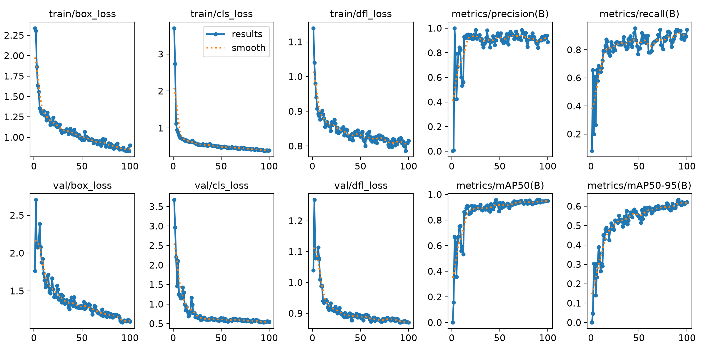

# YOLOv8n ROI 320×32 训练结果

本目录保存固定 ROI 钢球检测模型的训练指标和曲线图。

## 文件说明

| 文件 | 内容 |
| --- | --- |
| `results.csv` | 100 个 epoch 的损失、验证指标和学习率记录 |
| `results.png` | Ultralytics 生成的训练与验证曲线 |

## 最佳验证结果

按照 `metrics/mAP50-95(B)` 选择最佳 epoch：

| epoch | Precision | Recall | mAP50 | mAP50-95 |
| ---: | ---: | ---: | ---: | ---: |
| 91 | 0.90017 | 0.93278 | 0.95808 | 0.63293 |

第 100 个 epoch 的结果：

| epoch | Precision | Recall | mAP50 | mAP50-95 |
| ---: | ---: | ---: | ---: | ---: |
| 100 | 0.88808 | 0.94253 | 0.94893 | 0.62163 |

## 训练曲线

